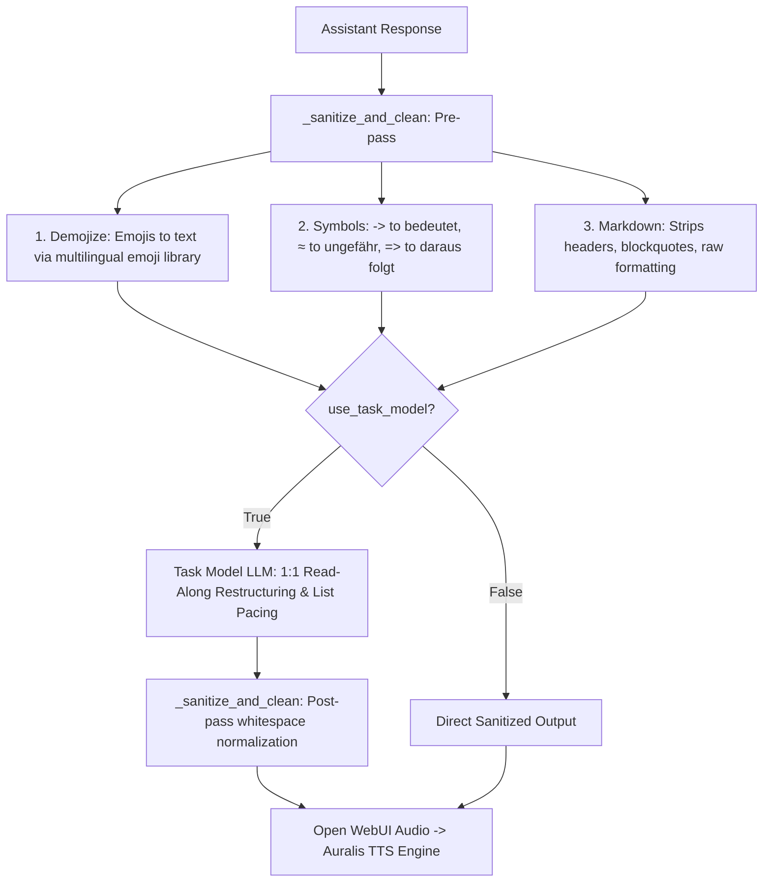

# Open WebUI ➔ Auralis TTS Integration & Read-Along Filter 🎧

This directory provides the **TTS Read-Along & Paragraph Optimizer Filter** (v2.1.0) for Open WebUI.

---

## 🎯 Purpose & Key Features

When synthesizing speech from LLM responses in Open WebUI, raw markdown, numbers/currencies, and visual emojis cause stuttering or unnatural pauses.

This filter provides a **two-tier optimization pipeline**:



1. **1:1 Synchronous Read-Along:** Preserves exact assistant wording so the user can comfortably read along on-screen while listening.
2. **Multilingual Emoji-to-Speech (`emoji.demojize`):**  
   Automatically detects user language (`de`, `en`, `es`, `fr`, etc.) and translates emojis into readable text (e.g. `🚀` ➔ `Rakete`, `😃` ➔ `Grinsendes Gesicht`) instead of breaking the TTS engine.
3. **Contextual Symbol Translation:**  
   Translates symbols according to their semantic meaning (`→` ➔ `bedeutet`, `≈` ➔ `ungefähr`, `=>` ➔ `daraus folgt`) rather than awkward literal words.
4. **Natural List Pacing:**  
   Removes unreadable bullet markers (`-`, `*`) and appends breathing periods (`.`) to short list points so XTTS speaks them with natural intonation.
5. **Exact Number & Date Preservation:**  
   Strictly retains digits, versions, dates, and IP addresses as numbers (`2026`, `3.12`, `15. April`) for native XTTS phonemization.

---

## 🚀 Setup & Installation in Open WebUI

> [!TIP]
> The `emoji` library is already pre-installed in standard Open WebUI container images, so no manual package installation is required.

### Step 1: Import the Filter Function
1. In Open WebUI, navigate to **Workspace ➔ Functions** (or **Admin Panel ➔ Functions**).
2. Click **`+` (Create Function)** and select **`Filter`**.
3. Copy and paste the entire content of [`tts_read_along_filter.py`](tts_read_along_filter.py).
4. Click **Save**.

### Step 2: Configure Filter Valves (⚙️ IMPORTANT)

> [!IMPORTANT]
> **Valve Settings do NOT automatically inherit global Open WebUI URLs!**  
> You must click the **gear icon (⚙️ Valves)** next to the function and explicitly configure `task_api_url`.

| Valve / Setting | Default | Description |
| :--- | :--- | :--- |
| **`use_task_model`** | `True` | Uses fast LLM task model for list restructuring and speech prosody |
| **`task_model`** | `gemma3:4b` | Fast task model name (e.g. `gemma3:4b`, `llama3.2:3b`) |
| **`task_api_url`** | `http://localhost:11434/v1` | **Must point to your Ollama / LLM endpoint** (e.g. `http://<ollama-host-ip>:11434/v1` or `http://host.docker.internal:11434/v1`). Note: `localhost` inside a Docker container refers to the container itself! |
| **`task_api_key`** | `ollama` | API key if authentication is required |
| **`clean_markdown`** | `True` | Enables Markdown stripping (headers, bold, italics, code) for clean speech |
| **`debug`** | `True` | Outputs verbose logs to Open WebUI Docker console (`docker logs -f open-webui`) |

### Step 3: Configure Open WebUI Audio Settings
1. Go to **Settings ➔ Audio ➔ TTS Settings** (or **Admin Panel ➔ Audio**).
2. Configure the following fields:
   * **TTS Engine:** `OpenAI`
   * **API Base URL:** `http://<auralis-server-ip>:8502/v1`
   * **API Key:** `dummy`
   * **TTS Model:** `xttsv2`
   * **Default Voice:** `anna-1` (or any `.wav` file in `voices/`)
   * **Split on:** **`Paragraphs`** (or **`Punctuation`**)

### Step 4: Enable Filter for Chat Models
1. Go to **Workspace ➔ Models**.
2. Select your desired chat model.
3. Under **Filters**, enable **`TTS Read-Along & Paragraph Optimizer`**.
4. Click **Save**.

---

## 🔍 Debugging & Log Inspection

To monitor the filter live in Open WebUI:

```bash
docker logs -f open-webui | grep "TTS-FILTER"
```

Sample output:
* `[TTS-FILTER] Outlet triggered for model 'gemma3:4b'`
* `[TTS-FILTER] Detected user language for Emojis: de`
