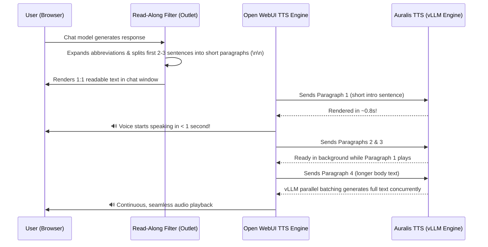

# Open WebUI Integration & Instant Read-Along Filter

Auralis is designed as a drop-in, zero-configuration local Text-to-Speech (TTS) engine for [Open WebUI](https://github.com/open-webui/open-webui).

---

## 🌟 Key Features for Open WebUI

* **Native OpenAI TTS API:** Compatible with `/v1/audio/speech`, `/v1/models`, and `/v1/audio/voices`.
* **Zero-Latency Voice Switching:** In-memory caching of speaker conditioning latents ensures switching voices (e.g. between `markus`, `anna-1`, and `marie`) incurs 0 ms overhead and 0 MB VRAM leakage.
* **vLLM FlashAttention Batching:** Multi-sentence paragraphs are computed in parallel GPU batches (`max_concurrency: 8`), delivering Real-Time Factors of **`0.18x`** (over 5x faster than real time).
* **Automatic Voice Discovery:** Drop any 24 kHz mono `.wav` file into the `voices/` directory, and it immediately appears in Open WebUI's voice dropdown.

---

## ⚙️ Open WebUI Configuration

### 1. Audio & TTS Settings

In Open WebUI, navigate to **Admin Panel ➔ Settings ➔ Audio ➔ TTS Settings** (or user audio settings):

| Setting | Value | Notes |
| :--- | :--- | :--- |
| **TTS Engine** | `OpenAI` | Uses standard OpenAI speech synthesis protocol |
| **API Base URL** | `http://<server-ip>:8502/v1` | Point to your Auralis server endpoint |
| **API Key** | `dummy` | Any non-empty string (e.g. `sk-none`) |
| **TTS Model** | `xttsv2` | Or `tts-1` / `tts-1-hd` (all supported) |
| **Default Voice** | `anna-1` | Matches filename in `voices/<name>.wav` |
| **Split on** | `Paragraphs` or `Punctuation` | **`Paragraphs`** is recommended when using the Read-Along Filter |

---

## 🎯 TTS Read-Along & Paragraph Optimizer Filter

When using TTS in chat, users want **instant playback (< 1 second)** while being able to **read along 1:1 on-screen**.

We provide a specialized Open WebUI Filter function located in [`integrations/open-webui/tts_read_along_filter.py`](https://github.com/mreschka/Auralis/blob/main/integrations/open-webui/tts_read_along_filter.py).

### How It Works



### Installation in Open WebUI

1. In Open WebUI, navigate to **Workspace ➔ Functions** (or **Admin Panel ➔ Functions**).
2. Click **`+` (Create Function)** and select **`Filter`**.
3. Paste the contents of `integrations/open-webui/tts_read_along_filter.py`.
4. Click **Save**.
5. Under **Workspace ➔ Models**, enable the filter for your active chat models.

---

## 🎙️ Custom Voice Cloning

To add custom voices:

1. Record 10–30 seconds of clean speech.
2. Convert to 24 kHz mono 16-bit PCM WAV:
   ```bash
   ffmpeg -i reference.mp3 -ar 24000 -ac 1 -c:a pcm_s16le voices/myvoice.wav
   ```
3. The voice `myvoice` will be immediately available via `GET /v1/audio/voices` and in Open WebUI.
