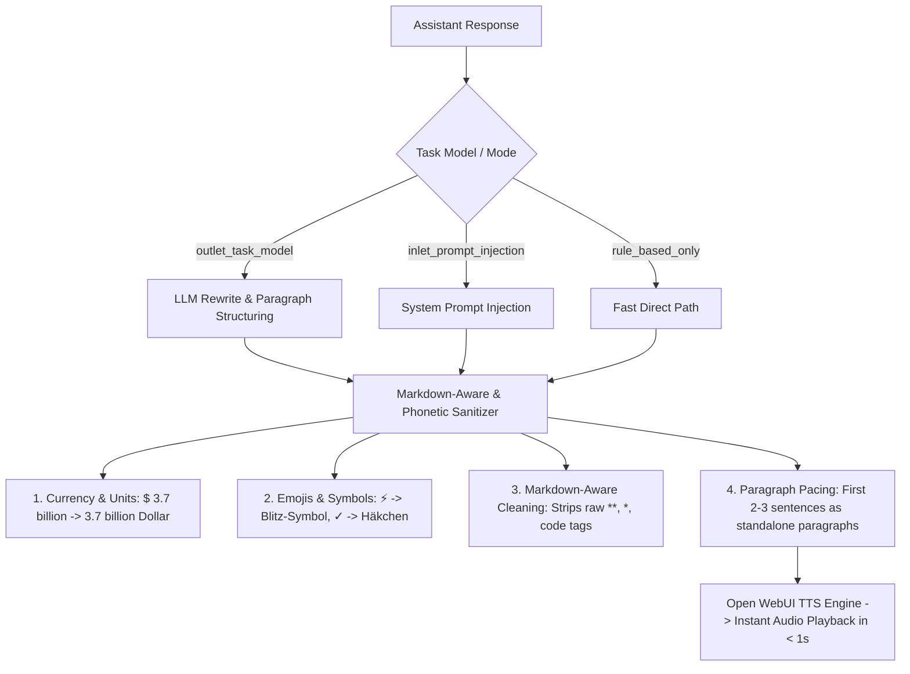

# Open WebUI ➔ Auralis TTS Integration & Read-Along Filter 🎧

This directory provides the **TTS Read-Along & Paragraph Optimizer Filter** (v1.2.0) for Open WebUI.

---

## 🎯 Purpose & Two-Tier Architecture

When synthesizing speech from LLM responses in Open WebUI, raw markdown, numbers/currencies, and lack of paragraph pacing cause stuttering or long delays.

This filter implements a **two-tier optimization pipeline**:



1. **1:1 Synchronous Read-Along:** Preserves the assistant's exact original text without hallucinating or altering sentences, allowing users to comfortably read along on-screen while listening.
2. **Markdown-Aware Cleaning:** Utilizes Markdown and HTML parsing (`markdown` + `BeautifulSoup`, built directly into Open WebUI) to reliably clean visual Markdown artifacts (`**`, `*`, `__`, code fences, horizontal lines) without breaking sentence boundaries.
3. **Phonetic Expansions:**
   * **Currencies & Units:** Expands `€ 1 250 000` ➔ `1 250 000 Euro`, `$ 3.7 billion` ➔ `3.7 billion Dollar`, `£ 750 000` ➔ `750 000 Pfund`, `%` ➔ `Prozent`, `°C` ➔ `Grad Celsius`.
   * **Emojis & Symbols:** Expands `⚡` ➔ `Blitz-Symbol`, `💡` ➔ `Glühbirnen-Symbol`, `✓` ➔ `Häkchen`, `✗` ➔ `Kreuz`, `©` ➔ `Copyright`, `™` ➔ `Trademark`, `#Tag` ➔ `Hashtag Tag`.
   * **Abbreviations:** Expands `z. B.` ➔ `zum Beispiel`, `bzw.` ➔ `beziehungsweise`, `d. h.` ➔ `das heißt`, `ca.` ➔ `circa`, `e.g.` ➔ `for example`.
4. **Paragraph Pacing (`\n\n`):** Breaks the first 2–3 sentences into individual short starter paragraphs so Open WebUI's `Split on: Paragraphs` triggers playback in under 1 second.

---

## 🚀 Setup & Configuration in Open WebUI

### Step 1: Import the Filter Function
1. In Open WebUI, navigate to **Workspace ➔ Functions** (or **Admin Panel ➔ Functions**).
2. Click **`+` (Create Function)** and select **`Filter`**.
3. Copy and paste the entire content of [`tts_read_along_filter.py`](tts_read_along_filter.py).
4. Click **Save**.

### Step 2: Configure Filter Valves (⚙️ IMPORTANT)

> [!IMPORTANT]
> **Valve Settings do NOT automatically inherit global Open WebUI URLs!**  
> You must click the **gear icon (⚙️ Valves)** next to the function and explicitly configure `task_api_url`.

| Valve / Setting | Default | Description |
| :--- | :--- | :--- |
| **`mode`** | `outlet_task_model` | `outlet_task_model` (rewrites via task model), `inlet_prompt_injection` (direct system prompt), or `rule_based_only` (instant deterministic sanitizer) |
| **`task_model`** | `gemma3:4b` | Fast task model (e.g. `gemma3:4b`, `llama3.2:3b`) |
| **`task_api_url`** | `http://localhost:11434/v1` | **Must point to your Ollama / LLM endpoint** (e.g. `http://<ollama-host-ip>:11434/v1` or `http://host.docker.internal:11434/v1`). Note: `localhost` inside a Docker container refers to the container itself! |
| **`task_api_key`** | `ollama` | API key if authentication is required |
| **`clean_markdown`** | `True` | Enables Markdown-aware parsing to strip visual markdown artifacts |
| **`debug`** | `True` | Outputs verbose logs to Open WebUI Docker console (`docker logs -f open-webui`) |

### Step 3: Configure Open WebUI Audio Settings
1. Go to **Settings ➔ Audio ➔ TTS Settings** (or **Admin Panel ➔ Audio**).
2. Configure the following fields:
   * **TTS Engine:** `OpenAI`
   * **API Base URL:** `http://<auralis-server-ip>:8502/v1`
   * **API Key:** `dummy`
   * **TTS Model:** `xttsv2`
   * **Default Voice:** `anna-1` (or any `.wav` file in `voices/`)
   * **Split on:** **`Paragraphs`** (or **`Punctuation`**)

### Step 4: Enable Filter for Chat Models
1. Go to **Workspace ➔ Models**.
2. Select your desired chat model.
3. Under **Filters**, enable **`TTS Read-Along & Paragraph Optimizer`**.
4. Click **Save**.

---

## 🔍 Debugging & Log Inspection

To watch the filter in real time:

```bash
docker logs -f open-webui | grep "TTS-FILTER"
```

Output format:
* `[TTS-FILTER] Outlet triggered for model 'gemma3:4b' at 'http://...'`
* `[TTS-FILTER] Original message length: 2363 chars`
* `[TTS-FILTER SUCCESS] Rewritten length: 2218 chars`
